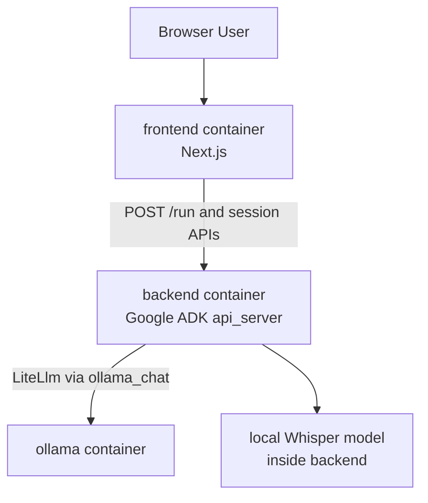

# MediSprache

MediSprache is a Docker-first demo for German medical dictation:

- a Python backend built with Google ADK
- local speech-to-text using a German medical Whisper variant
- Ollama for JSON clinical summarization
- a small Next.js frontend for audio upload and JSON display

## Architecture



## What It Does

1. Upload an MP3 or WAV file with a German medical dictation.
2. The frontend sends the file to the ADK backend using ADK's own REST API shape.
3. ADK stores the uploaded file as an artifact for the current session.
4. The agent calls a transcription tool that reads the artifact and runs Whisper.
5. The transcript is sent to Ollama.
6. The agent returns a `CompactClinicalSummary` JSON object with:
   - `patient_complaint`
   - `findings`
   - `diagnosis`
   - `next_steps`

## Prerequisites

- Docker
- Docker Compose

No local Python or Node setup is required for the main workflow.

## Docker Quickstart

Start the full stack:

```bash
docker compose up --build
```

If you see an error mentioning `dockerDesktopLinuxEngine` or `The system cannot find the file specified`, Docker Desktop is not running yet. Start Docker Desktop first, wait for the engine to be ready, then rerun `docker compose up --build`.

Services:

- Frontend: [http://localhost:3000](http://localhost:3000)
- ADK backend: [http://localhost:8000](http://localhost:8000)
- ADK Swagger docs: [http://localhost:8000/docs](http://localhost:8000/docs)
- Ollama: `http://localhost:11434`

Notes:

- On first startup, `ollama-init` pulls the configured Ollama model automatically.
- The first transcription request can be slow because the Whisper model must be downloaded and cached.
- The default LLM is `qwen3.5`, which is a newer and lighter open model for local agent workflows.
- If you want a heavier fallback focused on agentic tasks and structured outputs, set `OLLAMA_MODEL=gpt-oss:20b`.

## Docker Services

### `frontend`

- Built from [`frontend/Dockerfile`](frontend/Dockerfile)
- Runs the Next.js production app
- Proxies upload requests to the ADK backend

### `backend`

- Built from [`backend/Dockerfile`](backend/Dockerfile)
- Uses `uv` for dependency management
- Main ADK agent file: [`backend/medisprache/agent.py`](backend/medisprache/agent.py)
- Starts with:

```bash
uv run adk api_server --host 0.0.0.0 --port 8000
```

### `ollama`

- Uses the official `ollama/ollama` image
- Stores model data in a Docker volume

## Configuration

The compose file supports these environment variables:

| Variable | Default | Description |
|---|---|---|
| `OLLAMA_MODEL` | `qwen3.5` | Ollama model name used for the ADK agent |
| `OLLAMA_API_BASE` | `http://ollama:11434` | Ollama API base URL used inside the backend container |
| `WHISPER_MODEL` | `leduckhai/MultiMed-ST` | Speech-to-text model for German medical dictation |
| `WHISPER_DEVICE` | `cpu` | Whisper runtime device, e.g. `cpu` or `cuda` |
| `ADK_API_BASE` | `http://backend:8000` | Backend URL used by the frontend container |

## Local Development

Docker is the primary workflow, but the backend can still be run locally.

### Backend with `uv`

```bash
cd backend
uv sync
uv run python main.py ".\\medisprache\\fixtures\\sample_audio\\sample_01_bronchitis.mp3"
```

Run the ADK API server locally:

```bash
cd backend
uv run adk api_server --host 0.0.0.0 --port 8000
```

### Testing the CLI with `adk run`

Use the interactive ADK CLI to chat with the agent (transcribe/summarize flows work when you refer to local files or uploads):

```bash
cd backend
# Ensure Ollama is running (e.g. Docker: docker compose up -d ollama)
set OLLAMA_API_BASE=http://localhost:11434
set OLLAMA_MODEL=qwen2.5:3b
uv run adk run medisprache
```

From the prompt you can type things like:

- *Transcribe and summarize the audio at `C:\path\to\file.mp3`.* (uses server-local tool if path is on the same machine)
- Or use the session to upload artifacts and ask the agent to transcribe them.

Use `exit` to quit. Optional flags:

- `--save_session` — save session to `.session.json` on exit
- `--session_id my_session` — session ID when saving
- `--resume medisprache/my_session.session.json` — resume a saved session
- `--replay input.json` — run queries from a JSON file (non-interactive)
- `--session_service_uri memory://` — use in-memory session (default when not using `--use_local_storage`)
- `--artifact_service_uri memory://` — use in-memory artifacts

### Testing with `adk web`

Run the ADK web UI (dev-only, not for production) to chat with the agent in the browser:

```bash
cd backend
set OLLAMA_API_BASE=http://localhost:11434
set OLLAMA_MODEL=qwen2.5:3b
uv run adk web --port 8000
```

Open [http://localhost:8000](http://localhost:8000), pick the agent in the UI, and send messages. Use a different port if 8000 is already in use (e.g. `--port 8080`).

If you run locally outside Docker, point the backend to your local Ollama daemon:

```bash
set OLLAMA_API_BASE=http://localhost:11434
set OLLAMA_MODEL=qwen3.5
```

### Frontend locally

```bash
cd frontend
npm install
npm run dev
```

Then set:

```bash
set ADK_API_BASE=http://localhost:8000
```

## API Notes

The frontend talks to the backend using ADK's exposed endpoints:

- `POST /apps/{app}/users/{user}/sessions/{session}`
- `POST /run`

The backend app name is `medisprache`.

## Important Files

- [`backend/medisprache/agent.py`](backend/medisprache/agent.py): defines `root_agent` and the ADK `app`
- [`backend/medisprache/tools/transcribe_audio.py`](backend/medisprache/tools/transcribe_audio.py): Whisper transcription logic and ADK tools
- [`backend/medisprache/plugins/ollama_bridge.py`](backend/medisprache/plugins/ollama_bridge.py): plugin that normalizes Ollama tool-call behavior for ADK
- [`backend/main.py`](backend/main.py): local CLI entry point
- [`docker-compose.yml`](docker-compose.yml): runs `frontend`, `backend`, and `ollama`
- [`frontend/app/api/transcribe/route.js`](frontend/app/api/transcribe/route.js): server-side upload route that calls ADK

## Troubleshooting

### Docker engine is not running

Symptom:

```text
open //./pipe/dockerDesktopLinuxEngine: The system cannot find the file specified
```

Fix:

1. Start Docker Desktop.
2. Wait until Docker reports that the engine is running.
3. Run `docker compose up --build` again.

### Backend is up but frontend cannot reach it

Check:

```bash
docker compose ps
docker compose logs backend
docker compose logs frontend
```

The frontend container should talk to the backend using `http://backend:8000`, not `localhost`.

### ADK backend check

Once running, verify the backend with:

```bash
curl http://localhost:8000/list-apps
```

You should see:

```json
["medisprache"]
```

## Repository Layout

```text
backend/
  Dockerfile
  main.py
  pyproject.toml
  medisprache/
    agent.py
    plugins/
    schemas/
    tools/
frontend/
  Dockerfile
  app/
docker-compose.yml
```