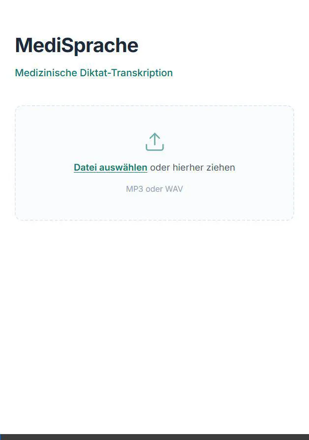
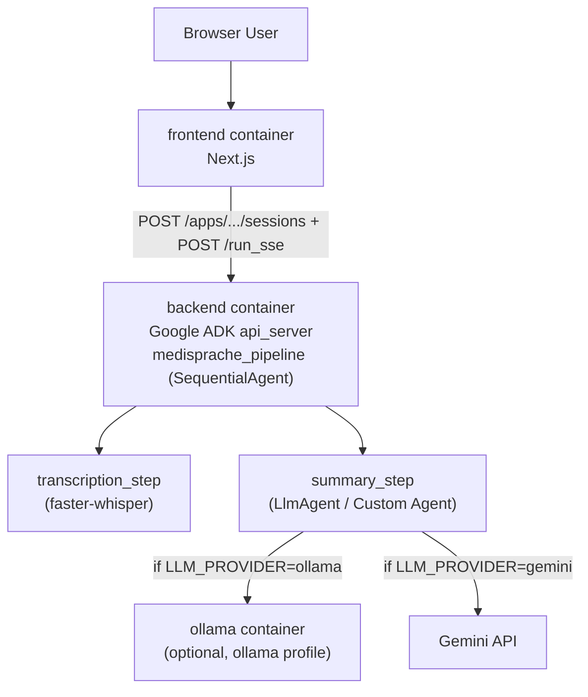

# MediSprache


> **Demo**
> 

A Docker-first demo for German medical dictation: upload audio, get a structured clinical summary as JSON.

Built with a Python backend (Google ADK agent), local speech-to-text (faster-whisper), and a selectable summary provider:
- Ollama (fixed model: `qwen2.5:1.5b`)
- Gemini (fixed model: `gemini-3-flash-preview`)

## Table of Contents

- [Features](#features)
- [Tech Stack](#tech-stack)
- [Architecture](#architecture)
- [What It Does](#what-it-does)
- [Prerequisites](#prerequisites)
- [Quick Start](#quick-start)
- [Docker Services](#docker-services)
- [Configuration](#configuration)
- [Local Development](#local-development)
- [API Notes](#api-notes)
- [Important Files](#important-files)
- [Troubleshooting](#troubleshooting)
- [Repository Layout](#repository-layout)

## Features

- **Local-first speech-to-text** using `faster-whisper`
- **LLM provider choice** at setup time: `ollama` or `gemini`
- **Fixed model mapping** for deterministic behavior:
  - `ollama` -> `qwen2.5:1.5b`
  - `gemini` -> `gemini-3-flash-preview`
- **Gemini summary calls** use thinking level `high`
- **Gemini mode** uses `response_mime_type=application/json` + `response_json_schema` for structured output
- **Deterministic ADK pipeline**: direct transcription step + structured summary step
- **Schema-driven prompt management** for summary generation
- **Interactive Next.js frontend** for upload, progress, and results

## Tech Stack

| Layer | Technology |
|---|---|
| Agent Framework | [Google ADK](https://github.com/google/adk-python) |
| Speech-to-Text | [faster-whisper](https://github.com/SYSTRAN/faster-whisper) |
| LLM (Ollama mode) | [Ollama](https://ollama.com/) (`qwen2.5:1.5b`) |
| LLM (Gemini mode) | Gemini API (`gemini-3-flash-preview`) |
| Backend | Python 3.13, [uv](https://docs.astral.sh/uv/) |
| Frontend | Next.js 15, React 19 |
| Infrastructure | Docker Compose |

## Architecture

> **Design Choice**: This application uses a deterministic two-step pipeline (Transcription → Summarization). This explicit separation maximizes accuracy for German medical terminology during speech-to-text and guarantees strict JSON schema enforcement during the summarization phase, ensuring reliable and structured output compared to single-pass multi-modal LLM calls.



## What It Does

1. Upload an MP3 or WAV file with German medical dictation.
2. Frontend creates an ADK session and sends audio to backend via `/run_sse`.
3. **`transcription_step`**: Deterministically runs faster-whisper on the uploaded artifact without LLM routing.
4. **`summary_step`**: Builds a structured summary from transcript text, sending it to the selected provider (`ollama` or `gemini`) to return a `CompactClinicalSummary`.
5. Frontend streams progress events (`stage`, `partial`, `result`) and shows final JSON fields:
   - `patient_complaint`
   - `findings`
   - `diagnosis`
   - `next_steps`

## Prerequisites

- [Docker Desktop](https://www.docker.com/products/docker-desktop/) (includes Docker Compose)
- A [Gemini API key](https://aistudio.google.com/app/apikey) (only if using the `gemini` provider)

No local Python or Node setup is required for the main workflow.

## Quick Start

### First-time setup (recommended)

**For macOS and Linux:**
```bash
bash setup.sh
```

**For Windows:**
We recommend using **WSL (Windows Subsystem for Linux)** or **Git Bash**. Do not use plain `cmd.exe` or PowerShell directly for the shell script.
```bash
# In your WSL terminal or Git Bash
bash setup.sh
```
*(If you encounter line-ending issues like `\r: command not found` on Windows, run `wsl sed -i 's/\r$//' ./setup.sh` first).*

`setup.sh` will:
- prompt for provider (`ollama` or `gemini`)
- prompt for Gemini API key only when `gemini` is selected
- persist required vars in repository `.env` and `backend/medisprache/.env`
- pre-pull Ollama model only for `ollama` mode
- auto-handle common WSL Docker credential-helper issues for this setup run

### Non-interactive setup (All OS)

```bash
LLM_PROVIDER=ollama bash setup.sh
# or
LLM_PROVIDER=gemini GOOGLE_API_KEY=your_key bash setup.sh
```

### Standard start

```bash
# Gemini mode (no ollama services)
docker compose up --build

# Ollama mode (includes ollama services)
docker compose --profile ollama up --build
```

If you see an error mentioning `dockerDesktopLinuxEngine` or `The system cannot find the file specified`, Docker Desktop is not running yet. Start Docker Desktop first, wait for engine readiness, then retry.

### Services

| Service | URL |
|---|---|
| Frontend | [http://localhost:3000](http://localhost:3000) |
| ADK Backend | [http://localhost:8000](http://localhost:8000) |
| ADK Swagger Docs | [http://localhost:8000/docs](http://localhost:8000/docs) |
| Ollama | `http://localhost:11434` (only with `--profile ollama`) |

### Notes

- Ollama model is fixed to `qwen2.5:1.5b`.
- Gemini model is fixed to `gemini-3-flash-preview`.
- `OLLAMA_MODEL` and `GEMINI_MODEL` are not configurable in this version.
- First transcription can be slow because Whisper artifacts must be downloaded/cached.

## Docker Services

### `frontend`

- Built from [`frontend/Dockerfile`](frontend/Dockerfile)
- Runs standalone Next.js (`node server.js`)
- Upload route calls ADK backend endpoints

### `backend`

- Built from [`backend/Dockerfile`](backend/Dockerfile)
- Uses `uv` for dependency management
- Main ADK agent file: [`backend/medisprache/agent.py`](backend/medisprache/agent.py)
- Starts with:

```bash
uv run adk api_server --host 0.0.0.0 --port 8000
```

### `ollama` (profile: `ollama`)

- Uses official `ollama/ollama` image
- Only started when using `docker compose --profile ollama ...`
- Stores model data in a Docker volume

## Configuration

| Variable | Default | Used By | Description |
|---|---|---|---|
| `LLM_PROVIDER` | none (required) | backend | LLM provider: `ollama` or `gemini` |
| `GOOGLE_API_KEY` | none | backend | Gemini API key (required for `gemini`) |
| `GEMINI_API_KEY` | none | backend | Fallback Gemini API key |
| `GOOGLE_GENAI_USE_VERTEXAI` | `false` | backend | Forces Gemini API-key mode (not Vertex AI) |
| `OLLAMA_API_BASE` | `http://ollama:11434` | backend | Ollama API base inside Docker network |
| `WHISPER_MODEL` | `base` | backend | faster-whisper model size |
| `WHISPER_DEVICE` | `cpu` | backend | Whisper device (`cpu` or `cuda`) |
| `WHISPER_BEAM_SIZE` | `3` | backend | Whisper beam width |
| `ADK_API_BASE` | `http://backend:8000` | frontend | ADK backend base URL |
| `SUMMARY_PROMPT_ID` | `compact_clinical_summary.v1` | backend | Prompt profile ID for schema-driven summary instructions |
| `MAX_AUDIO_UPLOAD_BYTES` | `52428800` (50MB) | frontend | Max uploaded audio size |
| `MAX_TRANSCRIBE_REQUEST_BYTES` | `MAX_AUDIO_UPLOAD_BYTES + 1MB` | frontend | Max request payload size |
| `MAX_CONCURRENT_TRANSCRIPTIONS` | `2` | frontend | Per-frontend process concurrency limit |

### Fixed model contract

- `LLM_PROVIDER=ollama` always uses `qwen2.5:1.5b`.
- `LLM_PROVIDER=gemini` always uses `gemini-3-flash-preview`.
- Setting `OLLAMA_MODEL` or `GEMINI_MODEL` to other values causes backend startup validation errors.

Environment variables are read on process/container start. After changing `.env` or compose config, recreate affected containers:

```bash
docker compose up -d --force-recreate frontend
# if backend env vars changed:
docker compose up -d --force-recreate backend
```

### Why two `.env` files?

- Root `.env` is used by Docker Compose when starting containers.
- `backend/medisprache/.env` is used by ADK tooling (`adk run`, `adk web`) when running from `backend`.
- `setup.sh` syncs provider-related keys to both locations so Docker and local ADK runs stay aligned.

## Local Development

Docker is the primary workflow, but backend/frontend can also run locally.

### Backend with `uv`

```bash
cd backend
uv sync

# choose provider via env
export LLM_PROVIDER=ollama
# or: export LLM_PROVIDER=gemini

# if gemini:
export GOOGLE_API_KEY=your_key

uv run python main.py ./medisprache/fixtures/sample_audio/sample_01_bronchitis.mp3
```

Run ADK API server locally:

```bash
cd backend
uv run adk api_server --host 0.0.0.0 --port 8000
```

### Testing with `adk run`

ADK auto-loads `.env` from the agent folder search path. For this project, place agent-level env at:

- `backend/medisprache/.env`

Run from the parent folder (`backend`) so ADK resolves `medisprache` correctly:

```bash
cd backend
uv run adk run medisprache
```

### Testing with `adk web`

```bash
cd backend
uv run adk web --port 8000
```

### Frontend locally

```bash
cd frontend
npm install
npm run dev
```

Set backend URL if needed:

```bash
# Windows (PowerShell)
$env:ADK_API_BASE = "http://localhost:8000"

# Linux / macOS
export ADK_API_BASE=http://localhost:8000
```

## API Notes

Frontend talks to backend with ADK endpoints:

- `POST /apps/{app}/users/{user}/sessions/{session}`
- `POST /run_sse`

Backend app name is `medisprache`.

## Important Files

- [`backend/medisprache/agent.py`](backend/medisprache/agent.py): provider resolution, fixed model mapping, ADK app wiring
- [`backend/medisprache/tests/unit/test_agent_provider.py`](backend/medisprache/tests/unit/test_agent_provider.py): provider mapping and validation tests
- [`backend/medisprache/prompts/registry.py`](backend/medisprache/prompts/registry.py): prompt profiles (`SUMMARY_PROMPT_ID`)
- [`backend/medisprache/tools/transcribe_audio.py`](backend/medisprache/tools/transcribe_audio.py): Whisper transcription tools
- [`frontend/app/api/transcribe/route.js`](frontend/app/api/transcribe/route.js): upload + SSE bridging route
- [`docker-compose.yml`](docker-compose.yml): frontend/backend services + optional ollama profile
- [`setup.sh`](setup.sh): first-run helper script with provider selection

## Troubleshooting

### Docker engine not running

Symptom:

```text
open //./pipe/dockerDesktopLinuxEngine: The system cannot find the file specified
```

Fix:

1. Start Docker Desktop.
2. Wait until the engine is ready.
3. Run Docker Compose again.

### Backend fails on startup with provider error

Common causes:

- `LLM_PROVIDER` missing or invalid
- `LLM_PROVIDER=gemini` but no `GOOGLE_API_KEY`/`GEMINI_API_KEY`
- `OLLAMA_MODEL` or `GEMINI_MODEL` set to non-fixed values

Fix by removing conflicting model env vars and setting required provider vars.

### WSL Docker credential helper error (`docker-credential-desktop.exe: exec format error`)

Symptom in `setup.sh` output:

```text
error getting credentials - err: fork/exec /usr/bin/docker-credential-desktop.exe: exec format error
```

Fix:

1. Run setup from WSL (`wsl bash ./setup.sh`) and keep Docker Desktop running.
2. `setup.sh` auto-detects this case and uses a temporary `DOCKER_CONFIG` for the setup process.
3. If it still fails, run once with a clean temporary Docker config:

```bash
wsl bash -lc 'cd /path/to/MediSprache && export DOCKER_CONFIG=$(mktemp -d) && printf "{}\n" > "$DOCKER_CONFIG/config.json" && bash ./setup.sh'
```

### Gemini 400 (`additional_properties`) during summary

Symptom in backend logs:

```text
Invalid JSON payload received. Unknown name "additional_properties"
```

Fix in this version:
- Gemini runs without ADK `output_schema` strict mode to avoid this SDK/API incompatibility.
- Frontend now surfaces backend SSE error text directly instead of only "missing final JSON".

### Frontend cannot reach backend

```bash
docker compose ps
docker compose logs backend
docker compose logs frontend
```

Frontend container should use `http://backend:8000`, not `localhost`.

### Verify backend

```bash
curl http://localhost:8000/list-apps
```

Expected:

```json
["medisprache"]
```

### `setup.sh` line-ending issue (`\r: command not found`)

```bash
# PowerShell + WSL (recommended)
wsl sed -i 's/\r$//' ./setup.sh

# Linux / macOS
sed -i 's/\r$//' setup.sh
# or: dos2unix setup.sh
```

## Repository Layout

```text
.gitattributes
.gitignore
docker-compose.yml
setup.sh
assets/
  medisprache_demo.webp
backend/
  Dockerfile
  main.py
  pyproject.toml
  uv.lock
  medisprache/
    agent.py
    fixtures/
      sample_audio/          # sample MP3/WAV files for testing
    plugins/
      ollama_bridge.py
    prompts/
      registry.py
      schema_prompt.py
    schemas/
    tests/
    tools/
      transcribe_audio.py
frontend/
  Dockerfile
  next.config.mjs
  package.json
  app/
    page.js
    layout.js
    api/transcribe/route.js
```
