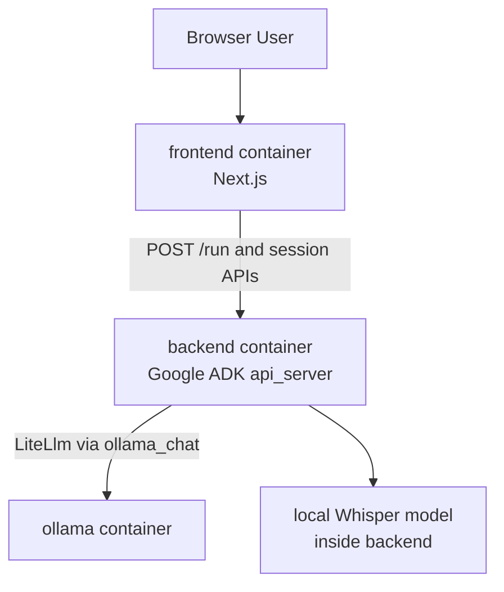

# MediSprache


A Docker-first demo for **German medical dictation**: upload audio, get a structured clinical summary as JSON — fully local, no cloud API keys needed.

Built with a Python backend (Google ADK agent), local speech-to-text (faster-whisper), Ollama for LLM summarization, and a Next.js frontend.

## Table of Contents

- [Features](#features)
- [Tech Stack](#tech-stack)
- [Architecture](#architecture)
- [What It Does](#what-it-does)
- [Prerequisites](#prerequisites)
- [Quick Start](#quick-start)
- [Docker Services](#docker-services)
- [Configuration](#configuration)
- [Local Development](#local-development)
- [API Notes](#api-notes)
- [Important Files](#important-files)
- [Troubleshooting](#troubleshooting)
- [Repository Layout](#repository-layout)

## Features

- **Local-first** — runs entirely on your machine, no cloud API keys required
- **German medical speech-to-text** using faster-whisper
- **LLM-powered clinical summarization** — structured JSON output via Ollama
- **Google ADK agent framework** with tool-calling and session management
- **One-command Docker Compose setup** with parallel builds
- **Interactive Next.js frontend** for audio upload and result display

## Tech Stack

| Layer | Technology |
|---|---|
| Agent Framework | [Google ADK](https://github.com/google/adk-python) |
| Speech-to-Text | [faster-whisper](https://github.com/SYSTRAN/faster-whisper) (German medical variant) |
| LLM | [Ollama](https://ollama.com/) (`qwen2.5:1.5b` default) |
| Backend | Python 3.13, [uv](https://docs.astral.sh/uv/) |
| Frontend | Next.js 15, React 19 |
| Infrastructure | Docker Compose |

## Architecture



## What It Does

1. Upload an MP3 or WAV file with a German medical dictation.
2. The frontend sends the audio (base64-encoded) to the ADK backend via `/run_sse`.
3. The agent calls a transcription tool that runs Whisper on the audio.
4. The transcript is sent to Ollama for structured extraction.
5. The agent returns a `CompactClinicalSummary` JSON object with:
   - `patient_complaint`
   - `findings`
   - `diagnosis`
   - `next_steps`

## Prerequisites

- [Docker Desktop](https://www.docker.com/products/docker-desktop/) (includes Docker Compose)

No local Python or Node setup is required for the main workflow.

## Quick Start

### First-time setup (recommended)

```bash
bash setup.sh
```

This script parallelizes image pulls, builds, and Ollama model downloads for a faster first run.

### Standard start

```bash
docker compose up --build
```

If you see an error mentioning `dockerDesktopLinuxEngine` or `The system cannot find the file specified`, Docker Desktop is not running yet. Start Docker Desktop first, wait for the engine to be ready, then try again.

### Services

| Service | URL |
|---|---|
| Frontend | [http://localhost:3000](http://localhost:3000) |
| ADK Backend | [http://localhost:8000](http://localhost:8000) |
| ADK Swagger Docs | [http://localhost:8000/docs](http://localhost:8000/docs) |
| Ollama | `http://localhost:11434` |

### Notes

- On first startup, `ollama-init` pulls the configured Ollama model automatically.
- The first transcription request can be slow because the Whisper model must be downloaded and cached.
- The default LLM is `qwen2.5:1.5b`, a lightweight model well-suited for local agent workflows and structured JSON output.

## Docker Services

### `frontend`

- Built from [`frontend/Dockerfile`](frontend/Dockerfile)
- Runs the standalone Next.js build (`node server.js`)
- Proxies upload requests to the ADK backend

### `backend`

- Built from [`backend/Dockerfile`](backend/Dockerfile)
- Uses `uv` for dependency management
- Main ADK agent file: [`backend/medisprache/agent.py`](backend/medisprache/agent.py)
- Starts with:

```bash
uv run adk api_server --host 0.0.0.0 --port 8000
```

### `ollama`

- Uses the official `ollama/ollama` image
- Stores model data in a Docker volume

## Configuration

The compose file supports these environment variables:

| Variable | Default | Description |
|---|---|---|
| `OLLAMA_MODEL` | `qwen2.5:1.5b` | Ollama model name used for the ADK agent |
| `OLLAMA_API_BASE` | `http://ollama:11434` | Ollama API base URL used inside the backend container |
| `WHISPER_MODEL` | `base` | faster-whisper model size; use `small` or `medium` on 16GB+ RAM |
| `WHISPER_DEVICE` | `cpu` | Whisper runtime device, e.g. `cpu` or `cuda` |
| `WHISPER_BEAM_SIZE` | `3` | Whisper beam search width; use `5` on 16GB+ RAM |
| `ADK_API_BASE` | `http://backend:8000` | Backend URL used by the frontend container |

## Local Development

Docker is the primary workflow, but the backend and frontend can also be run locally.

### Backend with `uv`

```bash
cd backend
uv sync
uv run python main.py ./medisprache/fixtures/sample_audio/sample_01_bronchitis.mp3
```

Run the ADK API server locally:

```bash
cd backend
uv run adk api_server --host 0.0.0.0 --port 8000
```

### Testing the CLI with `adk run`

Use the interactive ADK CLI to chat with the agent (transcribe/summarize flows work when you refer to local files or uploads):

```bash
cd backend

# Set environment variables:
# Windows (PowerShell)
$env:OLLAMA_API_BASE = "http://localhost:11434"
$env:OLLAMA_MODEL = "qwen2.5:1.5b"

# Linux / macOS
export OLLAMA_API_BASE=http://localhost:11434
export OLLAMA_MODEL=qwen2.5:1.5b

# Ensure Ollama is running (e.g. docker compose up -d ollama)
uv run adk run medisprache
```

From the prompt you can type things like:

- *Transcribe and summarize the audio at `/path/to/file.mp3`.*
- Or use the session to upload artifacts and ask the agent to transcribe them.

Use `exit` to quit. Optional flags:

- `--save_session` — save session to `.session.json` on exit
- `--session_id my_session` — session ID when saving
- `--resume medisprache/my_session.session.json` — resume a saved session
- `--replay input.json` — run queries from a JSON file (non-interactive)
- `--session_service_uri memory://` — use in-memory session (default)
- `--artifact_service_uri memory://` — use in-memory artifacts

### Testing with `adk web`

Run the ADK web UI (dev-only, not for production) to chat with the agent in the browser:

```bash
cd backend

# Set environment variables:
# Windows (PowerShell)
$env:OLLAMA_API_BASE = "http://localhost:11434"
$env:OLLAMA_MODEL = "qwen2.5:1.5b"

# Linux / macOS
export OLLAMA_API_BASE=http://localhost:11434
export OLLAMA_MODEL=qwen2.5:1.5b

uv run adk web --port 8000
```

Open [http://localhost:8000](http://localhost:8000), pick the agent in the UI, and send messages. Use a different port if 8000 is already in use (e.g. `--port 8080`).

### Frontend locally

```bash
cd frontend
npm install
npm run dev
```

The frontend reads `ADK_API_BASE` from the environment:

```bash
# Windows (PowerShell)
$env:ADK_API_BASE = "http://localhost:8000"

# Linux / macOS
export ADK_API_BASE=http://localhost:8000
```

## API Notes

The frontend talks to the backend using ADK's exposed endpoints:

- `POST /apps/{app}/users/{user}/sessions/{session}` — create a session
- `POST /run_sse` — stream agent execution via Server-Sent Events

The backend app name is `medisprache`.

## Important Files

- [`backend/medisprache/agent.py`](backend/medisprache/agent.py): defines `root_agent` and the ADK `app`
- [`backend/medisprache/tools/transcribe_audio.py`](backend/medisprache/tools/transcribe_audio.py): Whisper transcription logic and ADK tools
- [`backend/medisprache/plugins/ollama_bridge.py`](backend/medisprache/plugins/ollama_bridge.py): plugin that normalizes Ollama tool-call behavior for ADK
- [`backend/main.py`](backend/main.py): local CLI entry point
- [`docker-compose.yml`](docker-compose.yml): runs `frontend`, `backend`, and `ollama`
- [`frontend/app/api/transcribe/route.js`](frontend/app/api/transcribe/route.js): server-side upload route that calls ADK
- [`setup.sh`](setup.sh): parallel first-run setup script

## Troubleshooting

### Docker engine is not running

Symptom:

```text
open //./pipe/dockerDesktopLinuxEngine: The system cannot find the file specified
```

Fix:

1. Start Docker Desktop.
2. Wait until Docker reports that the engine is running.
3. Run `docker compose up --build` again.

### Backend is up but frontend cannot reach it

Check:

```bash
docker compose ps
docker compose logs backend
docker compose logs frontend
```

The frontend container should talk to the backend using `http://backend:8000`, not `localhost`.

### ADK backend check

Once running, verify the backend with:

```bash
curl http://localhost:8000/list-apps
```

You should see:

```json
["medisprache"]
```

### `setup.sh` fails with `\r: command not found`

This happens when the script has Windows-style line endings (CRLF). Fix:

```bash
# PowerShell
(Get-Content setup.sh -Raw) -replace "`r`n", "`n" | Set-Content setup.sh -NoNewline

# Linux / macOS
sed -i 's/\r$//' setup.sh
# or: dos2unix setup.sh
```

The `.gitattributes` in this repo prevents this from recurring for new clones.

## Repository Layout

```text
backend/
  Dockerfile
  main.py
  pyproject.toml
  medisprache/
    agent.py
    plugins/
    schemas/
    tests/
    tools/
frontend/
  Dockerfile
  app/
    api/transcribe/route.js
docker-compose.yml
setup.sh
.gitattributes
```