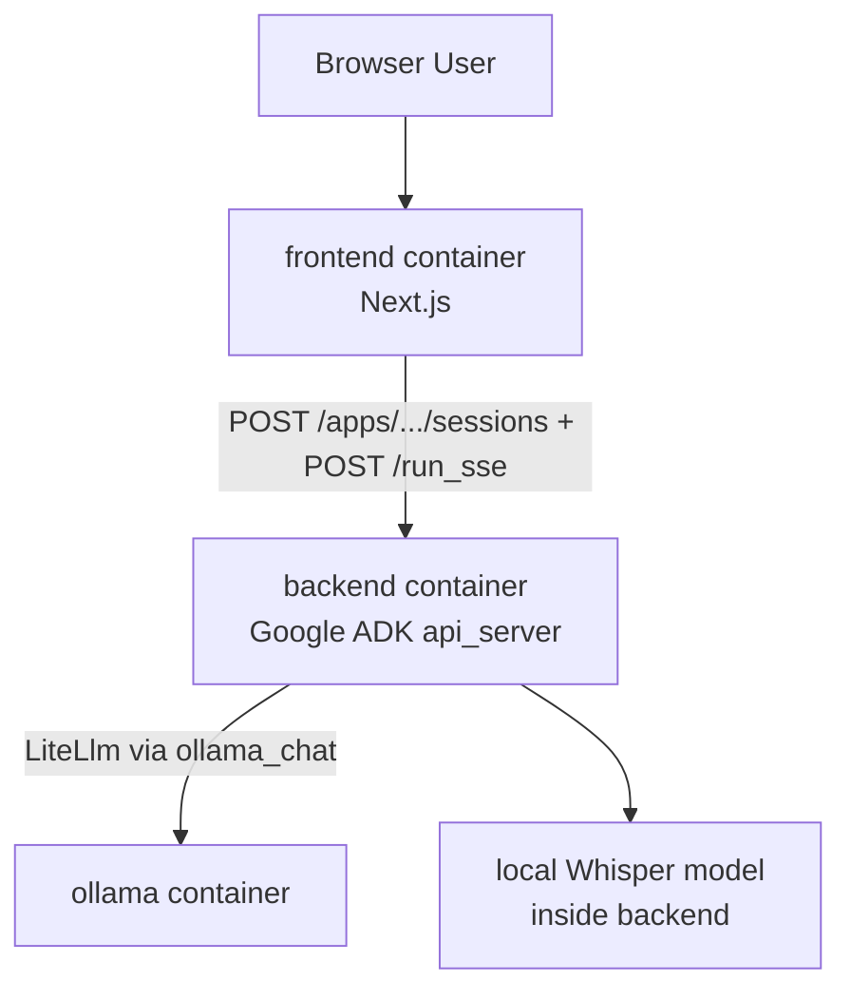

# MediSprache


A Docker-first demo for German medical dictation: upload audio, get a structured clinical summary as JSON - fully local, no cloud API keys required.

Built with a Python backend (Google ADK agent), local speech-to-text (faster-whisper), Ollama for LLM summarization, and a Next.js frontend.

## Table of Contents

- [Features](#features)
- [Tech Stack](#tech-stack)
- [Architecture](#architecture)
- [What It Does](#what-it-does)
- [Prerequisites](#prerequisites)
- [Quick Start](#quick-start)
- [Docker Services](#docker-services)
- [Configuration](#configuration)
- [Local Development](#local-development)
- [API Notes](#api-notes)
- [Important Files](#important-files)
- [Troubleshooting](#troubleshooting)
- [Repository Layout](#repository-layout)

## Features

- Local-first: runs entirely on your machine
- German medical speech-to-text using faster-whisper
- LLM-powered clinical summarization with structured JSON output via Ollama
- Deterministic ADK pipeline: direct transcription step + structured summary step
- Schema-driven prompt management for summary generation
- One-command Docker Compose setup
- Interactive Next.js frontend for upload, progress, and results

## Tech Stack

| Layer | Technology |
|---|---|
| Agent Framework | [Google ADK](https://github.com/google/adk-python) |
| Speech-to-Text | [faster-whisper](https://github.com/SYSTRAN/faster-whisper) |
| LLM | [Ollama](https://ollama.com/) (`qwen2.5:1.5b` default) |
| Backend | Python 3.13, [uv](https://docs.astral.sh/uv/) |
| Frontend | Next.js 15, React 19 |
| Infrastructure | Docker Compose |

## Architecture



## What It Does

1. Upload an MP3 or WAV file with German medical dictation.
2. Frontend creates an ADK session and sends audio to backend via `/run_sse`.
3. Deterministic transcription step runs faster-whisper on the uploaded artifact.
4. Summary step sends transcript text to Ollama and returns `CompactClinicalSummary` JSON.
5. Frontend streams progress and shows final JSON fields:
   - `patient_complaint`
   - `findings`
   - `diagnosis`
   - `next_steps`

## Prerequisites

- [Docker Desktop](https://www.docker.com/products/docker-desktop/) (includes Docker Compose)

No local Python or Node setup is required for the main workflow.

## Quick Start

### First-time setup (recommended)

```bash
bash setup.sh
```

This script parallelizes pulls/builds and model download for a faster first run.
On Windows, run it from Git Bash or WSL (not from plain `cmd.exe`).

### Standard start

```bash
docker compose up --build
```

If you see an error mentioning `dockerDesktopLinuxEngine` or `The system cannot find the file specified`, Docker Desktop is not running yet. Start Docker Desktop first, wait for the engine to be ready, then try again.

### Services

| Service | URL |
|---|---|
| Frontend | [http://localhost:3000](http://localhost:3000) |
| ADK Backend | [http://localhost:8000](http://localhost:8000) |
| ADK Swagger Docs | [http://localhost:8000/docs](http://localhost:8000/docs) |
| Ollama | `http://localhost:11434` |

### Notes

- `ollama-init` pulls the configured Ollama model on first startup.
- First transcription can be slow because Whisper artifacts must be downloaded/cached.
- Default LLM is `qwen2.5:1.5b`.

## Docker Services

### `frontend`

- Built from [`frontend/Dockerfile`](frontend/Dockerfile)
- Runs standalone Next.js (`node server.js`)
- Upload route calls ADK backend endpoints

### `backend`

- Built from [`backend/Dockerfile`](backend/Dockerfile)
- Uses `uv` for dependency management
- Main ADK agent file: [`backend/medisprache/agent.py`](backend/medisprache/agent.py)
- Starts with:

```bash
uv run adk api_server --host 0.0.0.0 --port 8000
```

### `ollama`

- Uses official `ollama/ollama` image
- Stores model data in a Docker volume

## Configuration

| Variable | Default | Used By | Description |
|---|---|---|---|
| `OLLAMA_MODEL` | `qwen2.5:1.5b` | backend, ollama-init | Ollama model name |
| `OLLAMA_API_BASE` | `http://ollama:11434` | backend | Ollama API base inside Docker network |
| `WHISPER_MODEL` | `base` | backend | faster-whisper model size |
| `WHISPER_DEVICE` | `cpu` | backend | Whisper device (`cpu` or `cuda`) |
| `WHISPER_BEAM_SIZE` | `3` | backend | Whisper beam width |
| `ADK_API_BASE` | `http://backend:8000` | frontend | ADK backend base URL |
| `SUMMARY_PROMPT_ID` | `compact_clinical_summary.v1` | backend | Prompt profile ID for schema-driven summary instructions |
| `MAX_AUDIO_UPLOAD_BYTES` | `52428800` (50MB) | frontend | Max uploaded audio size |
| `MAX_TRANSCRIBE_REQUEST_BYTES` | `MAX_AUDIO_UPLOAD_BYTES + 1MB` | frontend | Max request payload size |
| `MAX_CONCURRENT_TRANSCRIPTIONS` | `2` | frontend | Per-frontend process concurrency limit |

Environment variables are read on process/container start. After changing limits in `.env` or Compose config, recreate the affected container(s):

```bash
docker compose up -d --force-recreate frontend
# if backend env vars changed:
docker compose up -d --force-recreate backend
```

## Local Development

Docker is the primary workflow, but backend/frontend can also run locally.

### Backend with `uv`

```bash
cd backend
uv sync
uv run python main.py ./medisprache/fixtures/sample_audio/sample_01_bronchitis.mp3
```

Run ADK API server locally:

```bash
cd backend
uv run adk api_server --host 0.0.0.0 --port 8000
```

### Testing with `adk run`

```bash
cd backend

# Windows (PowerShell)
$env:OLLAMA_API_BASE = "http://localhost:11434"
$env:OLLAMA_MODEL = "qwen2.5:1.5b"

# Linux / macOS
export OLLAMA_API_BASE=http://localhost:11434
export OLLAMA_MODEL=qwen2.5:1.5b

uv run adk run medisprache
```

### Testing with `adk web`

```bash
cd backend
uv run adk web --port 8000
```

### Frontend locally

```bash
cd frontend
npm install
npm run dev
```

Set backend URL if needed:

```bash
# Windows (PowerShell)
$env:ADK_API_BASE = "http://localhost:8000"

# Linux / macOS
export ADK_API_BASE=http://localhost:8000
```

## API Notes

Frontend talks to backend with ADK endpoints:

- `POST /apps/{app}/users/{user}/sessions/{session}`
- `POST /run_sse`

Backend app name is `medisprache`.

## Important Files

- [`backend/medisprache/agent.py`](backend/medisprache/agent.py): root ADK app and pipeline wiring
- [`backend/medisprache/prompts/registry.py`](backend/medisprache/prompts/registry.py): prompt profiles (`SUMMARY_PROMPT_ID`)
- [`backend/medisprache/prompts/schema_prompt.py`](backend/medisprache/prompts/schema_prompt.py): schema-driven instruction builder
- [`backend/medisprache/schemas/clinical_summary.py`](backend/medisprache/schemas/clinical_summary.py): output schema definitions
- [`backend/medisprache/tools/transcribe_audio.py`](backend/medisprache/tools/transcribe_audio.py): Whisper transcription tools
- [`frontend/app/api/transcribe/route.js`](frontend/app/api/transcribe/route.js): upload + SSE bridging route
- [`docker-compose.yml`](docker-compose.yml): frontend/backend/ollama services
- [`setup.sh`](setup.sh): first-run helper script

## Troubleshooting

### Docker engine not running

Symptom:

```text
open //./pipe/dockerDesktopLinuxEngine: The system cannot find the file specified
```

Fix:

1. Start Docker Desktop.
2. Wait until the engine is ready.
3. Run `docker compose up --build` again.

### Frontend cannot reach backend

```bash
docker compose ps
docker compose logs backend
docker compose logs frontend
```

Frontend container should use `http://backend:8000`, not `localhost`.

### Verify backend

```bash
curl http://localhost:8000/list-apps
```

Expected:

```json
["medisprache"]
```

### `setup.sh` line-ending issue (`\r: command not found`)

```bash
# PowerShell
(Get-Content setup.sh -Raw) -replace "`r`n", "`n" | Set-Content setup.sh -NoNewline

# Linux / macOS
sed -i 's/\r$//' setup.sh
# or: dos2unix setup.sh
```

## Repository Layout

```text
backend/
  Dockerfile
  main.py
  pyproject.toml
  medisprache/
    agent.py
    prompts/
    schemas/
    tests/
    tools/
frontend/
  Dockerfile
  app/
    api/transcribe/route.js
docker-compose.yml
setup.sh
.gitattributes
```


